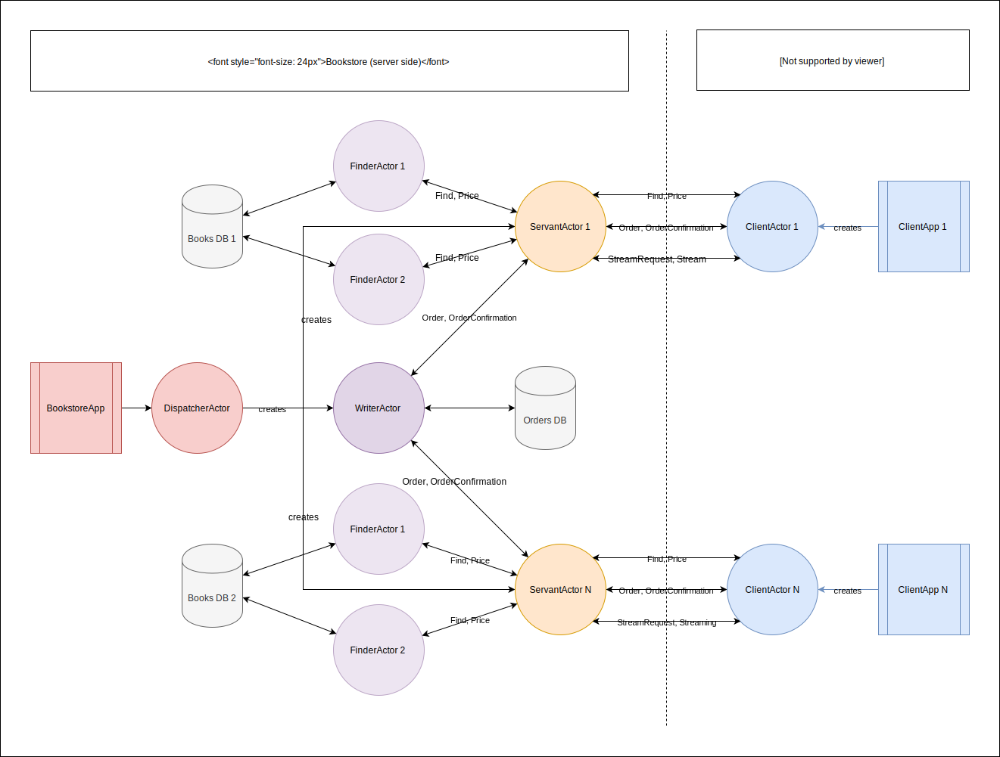

# Bookstore
This repository contains assignment for distributed systems course on AGH University of Science and Technology. It has whole JetBranins IntelliJ project with all necessary files and libarries, so you can clone or download and run it.

Notes:
* Required java version: 1.8
* Included libraries:
  * Akka 2.5.1
  * opencsv 4.6
* JetBrains IntelliJ project structure

## Architecture

